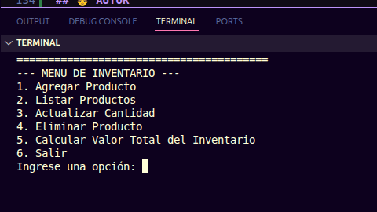

# 🧾 SISTEMA DE GESTIÓN DE INVENTARIO

Aplicación en Python para gestionar productos, cantidades y valor total de inventario usando persistencia en JSON.

## TABLA DE CONTENIDOS
- 📖[ Descripción General](#descripoción-general)
- 💻[ Tecnologías Usadas](#tecnologías-utilizadas)
- ✅[ Requisitos para el uso del proyecto](#-requisitos-para-utilizar-este-proyecto)
- ⬇️[ Instalacion del proyecto](#️-instalacion)
- ▶️[ USO](#uso)
- 📁 [ESTRUCTURA DEL PROYECTO](#-estructura-del-proyecto)
- 🦾 [FUNCIONALIDADES](#-funcionalidades)
- 🛡️ [VALIDACIONES DEL SISTEMA](#️-validaciones-del-sistema)
- 📷 [CAPTURAS DE PANTALLA](#-capturas-de-pantalla)
- 📌 [ROAD MAP](#-road-map)
- 👨 [AUTOR](#-autor)

## 📖 Descripción General
**-> ¿De qué se trata el proyecto?**
    
El proyecto "Gestión de un inventario" es un programa que permite al usuario hacer las siguientes operaciones:

1. Agregar un producto 
2. Listar los productos
3. Actualizar la cantidad de productos disponibles
4. Eliminar producto
5. Calcular valor total del inventario

**-> Publico objetivo**

Este proyecto está dirigido a personas que tienen tiendas pequeñas y necesitan de un sistema para llevar el control de sus productos.

**-> Problemas que se solucionan con este programa**

El programa reemplaza el registro manual en papel, facilitando la gestión y el control de los productos de manera más eficiente.

## 💻 Tecnologías Utilizadas

- [Python](https://www.python.org/downloads/release/python-3123/)

## ✅ Requisitos para utilizar este proyecto
1. Tener instalado [visual studio code](https://code.visualstudio.com/)
2. Tener instalado [git](https://git-scm.com/install/)
3. Tener instalado [python](https://www.python.org/downloads/release/python-3123/) version 3.12.3

## ⬇️ INSTALACIÓN DEL PROYECTO
> ⚠️ Debes tener instalados los requisitos anteriores

Para poder ejecutar el proyecto, debes seguir los siguientes pasos:

1. Copiar la URL del repositorio.
2. Abrir [visual studio code](https://code.visualstudio.com/).
3. Usa los comandos de tu sistema operativo para moverte al directorio (carpeta) donde quieres que se guarde el proyecto.
4. En la terminal de [visual studio code](https://code.visualstudio.com/) debes poner
    ```bash
    git clone https://github.com/usuario/repo.git 
    ```
5. Una vez finalizado, se creará una carpeta nueva con todo el contenido del repositorio.

## ▶️ USO

> ⚠️ Sigue los pasos al pie de la letra para que funcione correctamente 

1. En la terminal de [visual studio code](https://code.visualstudio.com/) debes de poner
    ```bash
    python3 main.py
    ```
2. Se iniciara el programa

> 👣 Pasos para la utilización del sistema

A primera vista se inicia el menú: 
 
- Opción 1: Registrar Producto

    1. Debe ingresar el nombre del producto
    2. Debe ingresar el precio del producto
    3. Debe ingresar la cantidad del producto disponible

- Opción 2: Listar productos

    1. Se muestran todos los productos registrados, mostrando
        - Nombre del producto 
        - Precio del producto 
        - Cantidad disponible del producto

- Opción 3: Actualizar cantidad
    
    El sistema pregunta por el nombre del producto que desea actualizar
    
    1. Ingrese el nombre del producto
    2. Ingrese la cantidad de producto disponible que desea

- Opción 4: Eliminar producto

    > ⚠️ El sistema borra todo el contenido que tiene este producto como: precio, cantidad disponible
    1. Debe ingresar el nombre del producto que desea eliminar.

- Opción 5: Calcular el valor total del inventario

    El sistema calcula el valor del total del inventario con esta formula:
    
    $$ \sum_{i=1}^{n} (precio_i \times cantidad_i) $$

    La suma del precio por la cantidad de todos los productos

- Opción 6: Salir 

    El programa se cierra
    
## 📁 ESTRUCTURA DEL PROYECTO

```bash
Gestion-inventario/
├── main.py
├── inventario.json
├── inventario.py
├── utilidades.py
└── README.md
```

## 🦾 FUNCIONALIDADES

| Función | Descripción |
|--------|------------|
| Agregar producto | Permite registrar nuevos productos en el inventario |
| Listar productos | Muestra todos los productos registrados |
| Actualizar cantidad | Permite modificar la cantidad de un producto |
| Eliminar producto | Elimina un producto del inventario |
| Calcular total | Calcula el valor total del inventario |

## 🛡️ VALIDACIONES DEL SISTEMA

El sistema incluye validaciones para garantizar un uso correcto:

- No permite ingresar texto en campos numéricos (menú,precio o cantidad).
- No permite ingresar números en campos de texto (nombre del producto)
- Verifica que los valores sean positivos.
- Evita seleccionar opciones inválidas del menú.
- Controla que el producto exista antes de actualizar o eliminar.

## 📷 CAPTURAS DE PANTALLA
> Estas capturas te pueden ayudar a tener una mejor idea de uso del proyecto

### Ejemplo de sistema en ejecución:

- Menú

    

- Opción 1: Agregar Productos

    

- Opción 2: Listar Productos
    
    

- Opción 3: Actualizar Producto

    

- Cambio de cantidad

    

- Opción 4: Eliminar Producto

    

- Opción 5: Calcular el valor total de producto

    

## 📌 ROAD MAP 
> Mejoras futuras del proyecto

1. Integrar función de vender producto para que automaticamente se elimine la cantidad de productos vendidos

## 👨 AUTOR
Programador Full-Stack Jr. Alan Gomez

GitHub: [AlanGomez-Programmer](https://github.com/AlanGomez-Programmer)

Linkedln: alan-gomez-763163320